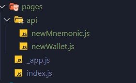

# section4 나모닉 코드 지갑 with Nextjs

## 간단한 지갑생성 사이트 만들어보기

- 간단한 프론트 페이지도 같이 만들어 볼 예정입니다.
  
- 기술스택 : nextjs, axios, eth-lightwallet

- 환경 : node 16.1.0, 나머지는 package.json 참조
- **node 환경이 17.8.0 일 경우** 에러발생!! 자세한 건 아래 주소 참조
    - [error:0308010C:digital envelope routines::unsupported"](https://stackoverflow.com/questions/69692842/error-message-error0308010cdigital-envelope-routinesunsupported)
- [eth-lightwallet 공식문서](https://github.com/ConsenSys/eth-lightwallet)
## 1. 기본 패키지 설치
```javascript
npx create-next-app@latest
yarn add axios eth-lightwallet
yarn dev
```

## 2. ./pages/api 경로에 newMnemonic.js, newWallet.js 파일 생성


## 3. 생성된 파일에 내용 입력

```javascript
// newMnemonic.js
...
mnemonic = lightwallet.keystore.generateRandomSeed();
// 니모닉 코드를 생성 하기 위해 eth-lightwallet라이브러리의
// generateRandomSeed() 함수를 사용했다.
...
```


```javascript
// newWallet.js

const newWallet = (req, res) => {
    ...
    const { body: { password, mnemonic } = {} } = req // 인자를 받고
    ...
    try {
        lightwallet.keystore.createVault( // keystore 생성 함수
            {
                password: password, // 비밀번호
                seedPhrase: mnemonic, // 니모닉 코드
                hdPathString: "m/0'/0'/0'" // HD derivation
            }, (err, keyStore) => {
                keyStore.keyFromPassword(password, function (err, pwDerivedKey) {
                    //이 인스턴스 메소드는 내부적으로 구성된 솔트를 사용한다.
                    //키 저장소를 암호화/복호화하는 데 사용되는 유형의 대칭 키를 생성한다.
                    keyStore.generateNewAddress(pwDerivedKey, 1);
                    // 자격 증명 모음에서 추가 내부 주소/개인 키 쌍을 생성할 수 있다.
                    const address = (keyStore.getAddresses()).toString();
                    // 현재 키 저장소에 저장된 16진수 문자열 주소 목록을 반환한다.
                    const keystore = keyStore.serialize();
                    // 현재 키 저장소 개체를 JSON 인코딩 문자열로 변환 후 해당 문자열을 반환한다.
                    fs.writeFile('wallet.json', keystore, function (err, data) {
                        if (err) {
                            return res.json({ code: 999, message: "실패" });
                        } else {
                            return res.json({ address, code: 1, message: "성공" });
                        }
                    });
                });
            }
        )
    }
}
```

## 간단한 테스트용 리액트 파일 만들기

```javascript

```


